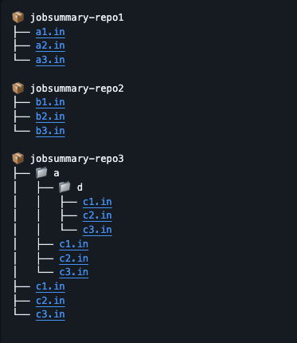
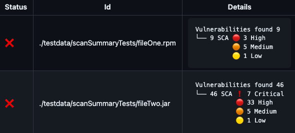

# CLI Command Summaries

## Overview

**The Command Summaries** feature enables the recording of JFrog CLI command outputs into the local file system.
This functionality can be used to generate a summary in the context of an entire workflow
(a sequence of JFrog CLU commands) and not only in the scope of a specific command.

Each command execution that incorporates this feature can save data files into the file system.
These files are then used to create an aggregated summary in Markdown format.

Saving data to the filesystem is essential because CLI command executes in separate contexts.
Consequently, each command that records new data should also incorporate any existing data into the aggregated markdown.
This is required because the CLI cannot determine when a command will be the last one executed in a sequence of commands.


An instance of how Command summaries are utilized can be observed in the [setup-cli GitHub action](https://github.com/jfrog/setup-jfrog-cli/blob/master/README.md#github-job-summaries).
This action employs the compiled markdown to generate a comprehensive summary of the entire workflow.

### Currently supported commands:
`jf rt upload`




`jf rt build-publish`


`jf scan `




`jf build-scan `


## Notes for Developers 

To use **The Command Summaries**, you'll need to set the `JFROG_CLI_COMMAND_SUMMARY_OUTPUT_DIR` environment variable.
This variable designates the directory where the data files and markdown files will be stored.

###  ⚠️ Attention: Files Remain After CLI Execution
The CLI does not automatically remove the files as they are designed to remain beyond a single execution.
As a result, it is your responsibility to you to manage your pipelines and delete files as necessary.
You can clear the entire directory
of `JFROG_CLI_COMMAND_SUMMARY_OUTPUT_DIR` that you have configured to activate this feature.

### How to Implement? 

If you wish to implement your own summary, follow these steps:

1. Implement the CommandSummaryInterface
2. Record data during runtime

#### Implement the CommandSummaryInterface
 ```go
type CommandSummaryInterface interface {
	GenerateMarkdownFromFiles(dataFilePaths []string) (finalMarkdown string, err error)
}
 ```

#### Record Data During Runtime
```go
// Initialize your implementation
myNewCommandSummary, err := commandsummary.New(&MyCommandStruct{}, "myNewCommandSummary")
if err != nil {
    return
}
// Record
return myNewCommandSummary.Record(data)
 ```

The `GenerateMarkdownFromFiles` function needs to process multiple data files, which are the results of previous command executions, and generate a single markdown string content. As each CLI command has its own context, we need to regenerate the entire markdown with the newly added results each time.

### Example Implementation


```go
// Step 1. Implement the CommandSummaryInterface
type CommandStruct struct{}

type singleRecordedObject struct {
	Name string
}

func (cs *CommandStruct) GenerateMarkdownFromFiles(dataFilePaths []string) (markdown string, err error) {
	// Aggregate all the results into a slice
	var recordedObjects []*singleRecordedObject
	for _, path := range dataFilePaths {
		var singleObject singleRecordedObject
		if err = commandsummary.UnmarshalFromFilePath(path, &singleObject); err != nil {
			return
		}
		recordedObjects = append(recordedObjects, &singleObject)
	}

	// Create markdown
	markdown = results.String()
	return
}

// Step 2. Record data during runtime
func recordCommandSummary(data any) (err error) {
	if !commandsummary.ShouldRecordSummary() {
		return
	}

	commandSummaryImplementation, err := commandsummary.New(&CommandStruct{}, "CommandName")
	if err != nil {
		return
	}

	return commandSummaryImplementation.Record(data)
}

 ```

### How Does It Work? 

Each command that implements the `CommandSummaryInterface` will have its own subdirectory inside the `JFROG_CLI_COMMAND_SUMMARY_OUTPUT_DIR/JFROG_COMMAND_SUMMARY` directory.

Each subdirectory will contain data files, each representing a command recording, and a markdown file which has been generated from all the data files.


```
JFROG_CLI_COMMAND_SUMMARY_OUTPUT_DIR/JFROG_COMMAND_SUMMARY  
│
└─── Command1
│       datafile1.txt
│       datafile2.txt
│       markdown.txt
│   
└─── Command2
        datafile1.txt
        datafile2.txt
        markdown.txt
```

The user-implemented function will process all of the data files inside its subdirectory and will generate a markdown string.

